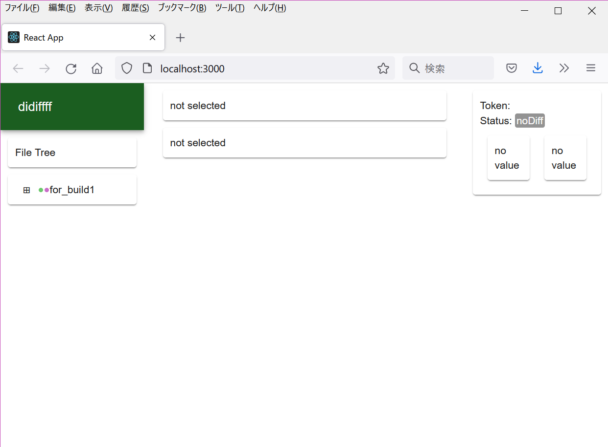
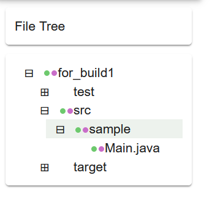
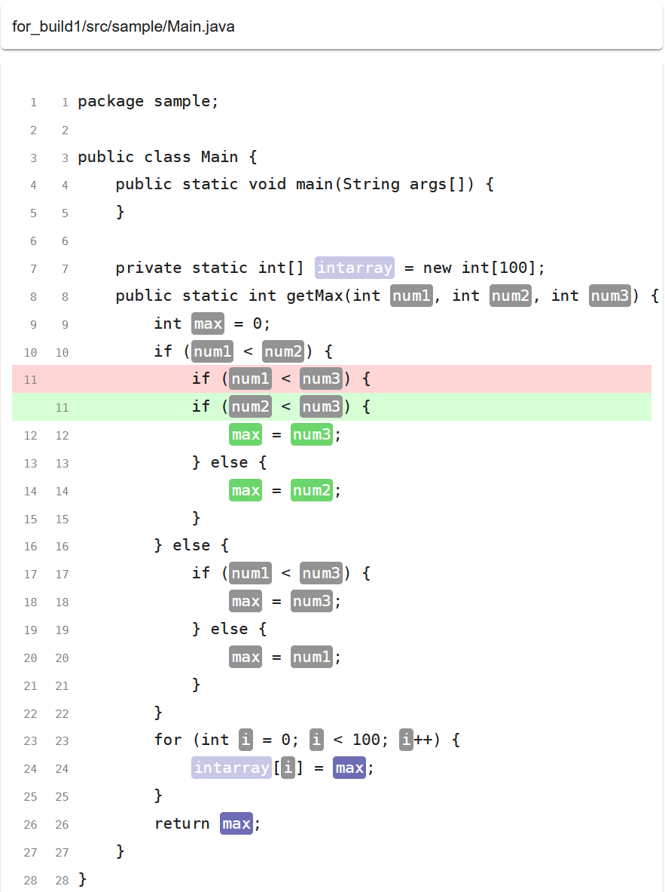
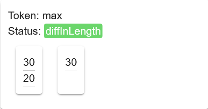

# didiffff simple tutorial with sample project

Here, we use the same example project as [NOD4J debbuging sample](https://github.com/k-shimari/nod4j/wiki/Try-our-viewer-in-a-debugging-sample).

The detail of debugging target is described in [here](https://github.com/k-shimari/nod4j/wiki/Try-our-viewer-in-a-debugging-sample#the-detail-of-debugging-target).

## Requirements

* Node.js
* Java Runtime Environment (to run NOD4J post processor)
* Apache Maven (to build and test an example project.)

  We have tested with Node16 and Java8.

## Prepare

First, clone our repository and build an internal module.
After that, get required modules for the viewer.

```sh
git clone https://github.com/tetsuyakanda/didiffff
cd didiffff/kurakuraberuberu
npm install
cd ../didiffff
npm install
```

Copy `selogger-0.2.3.jar`, NOD4J trace recorder, and `nod4j-0.2.3-t.jar`, NOD4J post processor, to `<CLOENED_ROOT>/sample/`.

```sh
cd <CLOENED_ROOT>/sample
curl -OL https://github.com/takashi-ishio/selogger/releases/download/v0.2.3/selogger-0.2.3.jar
cp ../nod4j-0.2.3-t.jar .
```

## Getting execution trace (1)

Run the sample project with SELogger.
Settings are already described in `pom.xml` so you can get the execution trace by running `mvn test` command.

```sh
cd <CLOENED_ROOT>/sample/project/
mvn test
```

We can find the execution trace in `<CLOENED_ROOT>/sample/selogger`.

## Convert (1)

```sh
cd <CLOENED_ROOT>/sample/
java -jar nod4j-0.2.3-t.jar ./project/ ./selogger/ ../didiffff/public/assets/proj1
```

You can find `fileinfo.json` and `varinfo.json` under `<CLOENED_ROOT>/didiffff/public/assets/proj1/`.

## Getting another trace (2)

Next, fix the bug and get a new execution trace.
Change the variable "num1" on line 11 to "num2", then run the sample project with SELogger again.

```sh
cd <CLOENED_ROOT>/sample/project/
mvn test
```

## Convert (2)

Don't forget to change the output path to `proj2` to prevent overwriting.

```sh
cd <CLOENED_ROOT>/sample/
java -jar nod4j-0.2.3-t.jar ./project/ ./selogger/ ../didiffff/public/assets/proj2
```

## Calc diff of two execution traces

```sh
cd <CLOENED_ROOT>/didiffff
npm run load
```

Run `npm run load` to compare and combine two execution traces.
The result is output to  `<CLOENED_ROOT>/didiffff/public/assets/target.json`.

## Launch the viewer

```sh
npm run start
```

Access `localhost:3000` on Web browser.



## File Tree View



Directories and files have two indicators.
The first (green) one represents there are differences in code and the second (purple) one represents there are differences in execution traces.

Now you can see both indicators of `for_build1` directory are colored.
Click "+" mark and find `Main.java` in `for_build1/src/sample` directory.
You can also see that other directories have no differences in code and in execution traces.

Select `Main.java` and go to next step.

## Source Code View



Firstly you can find that line 11 has been changed.
Looking at line 8, all arguments have exactly the same trace so we can see that inputs of this method are the same before and after the code changes.

## Value List View



Now let us see the changes in the value list caused by code changes.
Click the variable `max` on line 12 then the value list view is updated.
The view shows the category and its value lists.
We can see that the length of value lists are different, which is caused by code changes on line 11.
Using this view, we can compare the detailed difference of two executions.
You can click and see other variables for further investigation.
